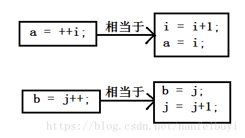

# Lab 3

>本次lab安排：
>
>1. 巩固C语言运算符相关知识
>2. 运算符相关选择题与填空题
>3. 在头歌平台使用编程解决实际问题


## 获取及提交lab

**获取**：通过 `https://github.com/fdu-21ss-programming/lab3`或者`超星平台`获取。

**提交**：本次lab附带的练习题将于2021年10月9日15:25发布于**头歌平台**，lab文档内附带的选择题与填空题需要在**超星平台**对应作业处提交

**截止时间**：2021年10月13日 23:59:59


## 1. 自增自减运算符

下表中假设A的值为10

| 运算符 | 描述                     | 示例                   |
| ------ | ------------------------ | ---------------------- |
| ++     | 自增运算符，整数值增加1  | 设A为10，则A++将得到11 |
| --     | 自减运算符，整数值减少 1 | 设A为10，则A--将得到9  |

自增自减运算符的难点在于理解其放在操作数前和放在操作数后的区别，以自增运算符为例，对于`i++`和`++i`这两个表达式，无论`++`放在`i`的前面还是后面，最后`i`的值都会自增1，区别在于是先自增还是先参与运算

当`++`在`i`前面时，先进行`++`操作，后参与运算，当`++`在`i`后面时，先参与运算，后进行`++`操作，如下图所示



在下面的示例代码中再一次强调了先赋值后运算与先运算后赋值的区别

```c
#include <stdio.h>
 
int main()
{
   int c;
   int a = 10;
   c = a++; 
   printf("先赋值后运算：\n");
   printf("Line 1 - c 的值是 %d\n", c );	// Line 1 - c 的值是 10
   printf("Line 2 - a 的值是 %d\n", a );	// Line 2 - a 的值是 11
   a = 10;
   c = a--; 
   printf("Line 3 - c 的值是 %d\n", c );	// Line 3 - c 的值是 10
   printf("Line 4 - a 的值是 %d\n", a );	// Line 4 - a 的值是 9
 
   printf("先运算后赋值：\n");
   a = 10;
   c = ++a; 
   printf("Line 5 - c 的值是 %d\n", c );	// Line 5 - c 的值是 11
   printf("Line 6 - a 的值是 %d\n", a );	// Line 6 - a 的值是 11
   a = 10;
   c = --a; 
   printf("Line 7 - c 的值是 %d\n", c );	// Line 7 - c 的值是 9
   printf("Line 8 - a 的值是 %d\n", a );	// Line 8 - a 的值是 9
}
```

当一个表达式里出现多个自增符后会是怎样的情况呢？（自减符同理，此处不展开）

```c
int i = 3;
int j = 4;
int a = i++ + i++ + i++;
int b = ++j + ++j + ++j;
printf("a=%d,b=%d\n", a, b);
```

事实上，使用不同编译器编译这段程序，其运行结果会有所不同，因为对这种表达式的实际处理方式是交由编译器自行发挥的（这也意味着在实际写代码的时候**不要**写这种）

例如，使用`gcc`编译的结果为`a=12,b=19`，

在`i++ + i++ + i++`中，第一个参与运算的是i的初始值3，i自增后，第二个参与运算的是4，i自增后，第三个参与运算的是5，因此实际上是3 + 4 + 5

在`++j + ++j + ++j`中，因为存在两个同级的+运算，根据+运算符的左结合性，在编译时，其实是先处理前面的(++j + ++j)这部分，然后再将此结果和++j相加，而gcc认为++j + ++j是先自增两次然后再参加+运算，即6 + 6 + 7

而如果使用`clang`编译的话，结果会为`a=12,b=18`，

它在处理`++j + ++j + ++j`时，认为第一个参与运算的是j自增后的值5，第二个是j自增后的值6，第三个是j自增后的值7，即5 + 6 + 7


## 2. 关系运算符

下表中假设A的值为10，B的值为20

| 运算符 | 描述                                                         | 实例            |
| ------ | ------------------------------------------------------------ | --------------- |
| ==     | 检查两个操作数的值是否相等，如果相等则条件为真。             | (A == B) 为假。 |
| !=     | 检查两个操作数的值是否相等，如果不相等则条件为真。           | (A != B) 为真。 |
| >      | 检查左操作数的值是否大于右操作数的值，如果是则条件为真。     | (A > B) 为假。  |
| <      | 检查左操作数的值是否小于右操作数的值，如果是则条件为真。     | (A < B) 为真。  |
| >=     | 检查左操作数的值是否大于或等于右操作数的值，如果是则条件为真。 | (A >= B) 为假。 |
| <=     | 检查左操作数的值是否小于或等于右操作数的值，如果是则条件为真。 | (A <= B) 为真。 |

在C语言中，比较符称为关系运算符，所谓关系运算就是比较运算，将两个数值进行比较，判断其比较的结果是否符合给的的条件

后4种关系运算符的优先级别相同，前2种的也相同，后4种高于前2种

关系运算符可以用于比较字符，比较时使用的是机器字符码（一般为ASCII），但是不能用关系运算符比较字符串

虽然关系运算符也可用来比较浮点数，但是要注意：比较浮点数时，尽量只使用 `<` 和 `>`。因为浮点数的舍入误差会导致在逻辑上应该相等的两数却不相等。例如，3 乘以 1/3 的积是 1.0。如果用把 1/3 表示成小数点后面 6 位数字，乘积则是 .999999，不等于 1


## 3. 逻辑运算符

下表中假设A的值为1，B的值为0

| 运算符 | 描述                                                         | 实例              |
| ------ | ------------------------------------------------------------ | ----------------- |
| &&     | 称为逻辑与运算符。如果两个操作数都非零，则条件为真。         | (A && B) 为假。   |
| \|\|   | 称为逻辑或运算符。如果两个操作数中有任意一个非零，则条件为真。 | (A \|\| B) 为真。 |
| !      | 称为逻辑非运算符。用来逆转操作数的逻辑状态。如果条件为真则逻辑非运算符将使其为假。 | !(A && B) 为真。  |

与运算符(&&)和或运算符(||)均为双目运算符，具有左结合性，非运算符(!)为单目运算符，具有右结合性


## 4. 位运算符

下表中假设A的值为60（二进制表示为`0011 1100`），B的值为13（二进制表示为`0000 1101`）

| 运算符 | 描述                                                         | 实例                                                         |
| ------ | ------------------------------------------------------------ | ------------------------------------------------------------ |
| &      | 按位与操作，按二进制位进行"与"运算。运算规则：`0&0=0;    0&1=0;     1&0=0;      1&1=1;` | (A & B) 将得到 12，即为 0000 1100                            |
| \|     | 按位或运算符，按二进制位进行"或"运算。运算规则：`0|0=0;    0|1=1;    1|0=1;     1|1=1;` | (A \| B) 将得到 61，即为 0011 1101                           |
| ^      | 异或运算符，按二进制位进行"异或"运算。运算规则：`0^0=0;    0^1=1;    1^0=1;   1^1=0;` | (A ^ B) 将得到 49，即为 0011 0001                            |
| ~      | 取反运算符，按二进制位进行"取反"运算。运算规则：`~1=-2;    ~0=-1;` | (~A ) 将得到 -61，即为 1100 0011，一个有符号二进制数的补码形式。 |
| <<     | 二进制左移运算符。将一个运算对象的各二进制位全部左移若干位（左边的二进制位丢弃，右边补0）。 | A << 2 将得到 240，即为 1111 0000                            |
| >>     | 二进制右移运算符。将一个数的各二进制位全部右移若干位，正数左补0，负数左补1，右边丢弃。 | A >> 2 将得到 15，即为 0000 1111                             |

注意与逻辑运算符区分开

在底层的系统软件中，常常需要处理二进制位的问题，C语言提供了6个位操作运算符，这些运算符只能用于整型操作数，即只能用于带符号或无符号的`char`，`short`，`int`与`long`类型

运算对象A左移k位得到的值为$A*2^k$

同理，右移k位得到的值为$A/2^k$


## 5. 练习题

> 练习题答案需要提交在超星学习通对应作业区域

1. 设有语句`int a = 3;`，则执行了语句`a += a -= a *= a;`后，变量`a`的值是()

   A. 3	B. 0	C. 9	D. -12

2. 设整型变量`i`值为2，表达式`(++i) + (++i) + (++i)`的结果是()

   A. 6	B. 12	C. 15	D. 表达式出错

3. 设`a`为整型变量，不能正确表达数学关系：`10 < a < 15`的C语言表达式是()

   A. 10 < a < 15

   B. a == 11 || a == 12 || a == 13 || a == 14

   C. a > 10 && a < 15

   D. !(a <= 10) && !(a >= 15)

4. 求解赋值表达式`a = (b = 10) % (c = 6)`，a、b、c的值依次为\____。

5. 设`c = 'w'`，`a = 1`，`b = 2`，`d = -5`，则表达式`'x' + 1 > c`，`'y' != c + 2`，`-a - 5 * b <= d + 1`，`b == a = 2`的值分别为\____。
